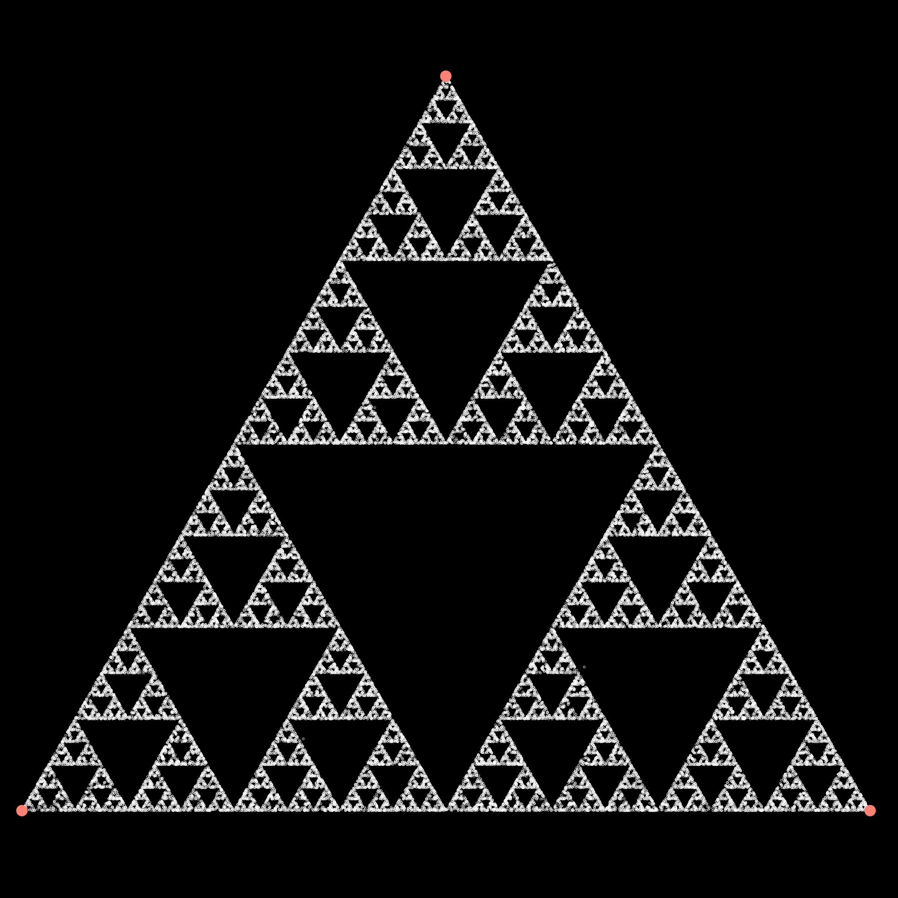

Create fractals with the chaos game. Useage:

``python chaos.py --num-vertices <N> --alpha <a>``

where N is the number of vertices/edges of the regular polygon, and a is the proportion of the distance to move towards a randomly chosen vertex at each step. N=3 and a=0.5 gives the Sierpinski triangle.

